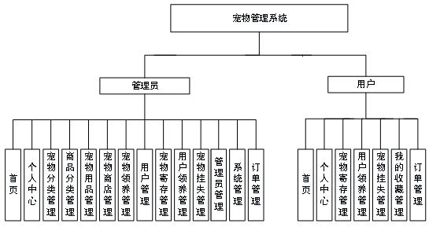
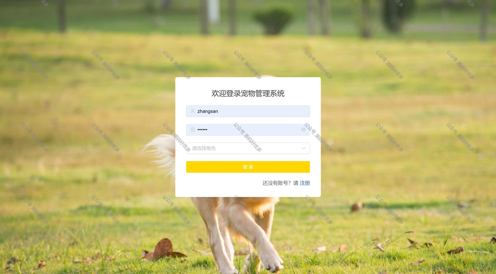
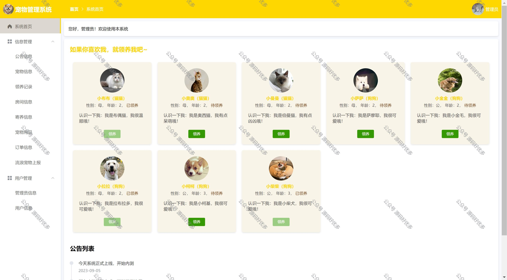
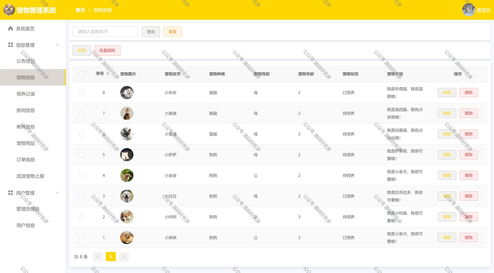
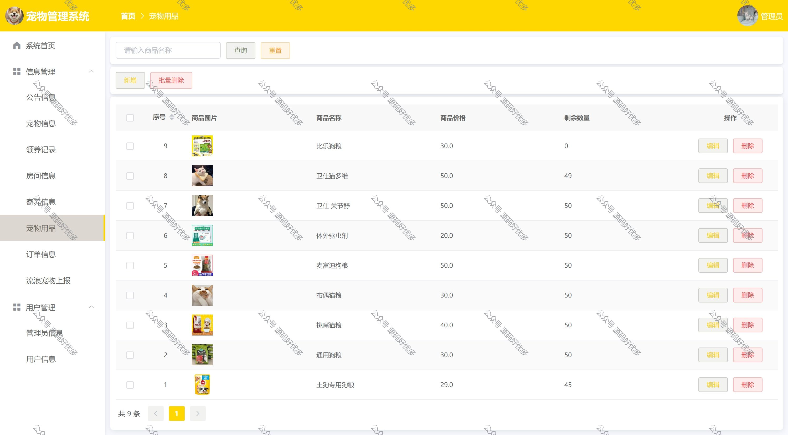
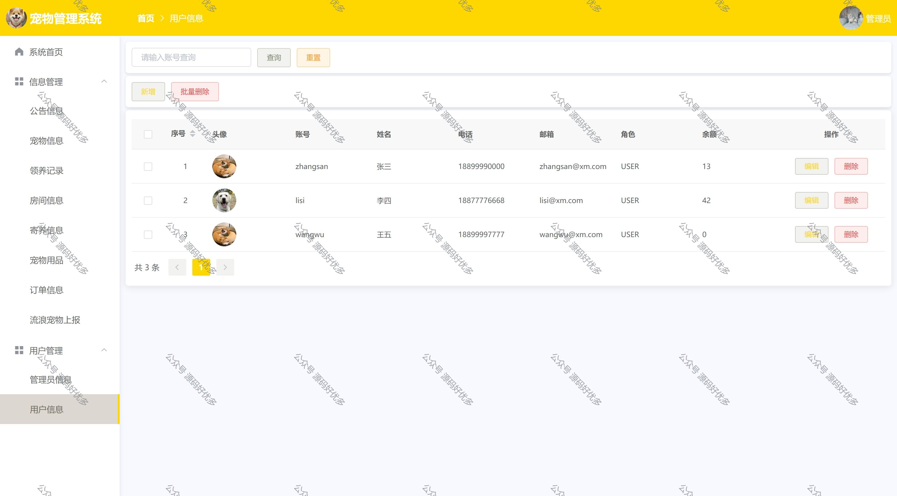
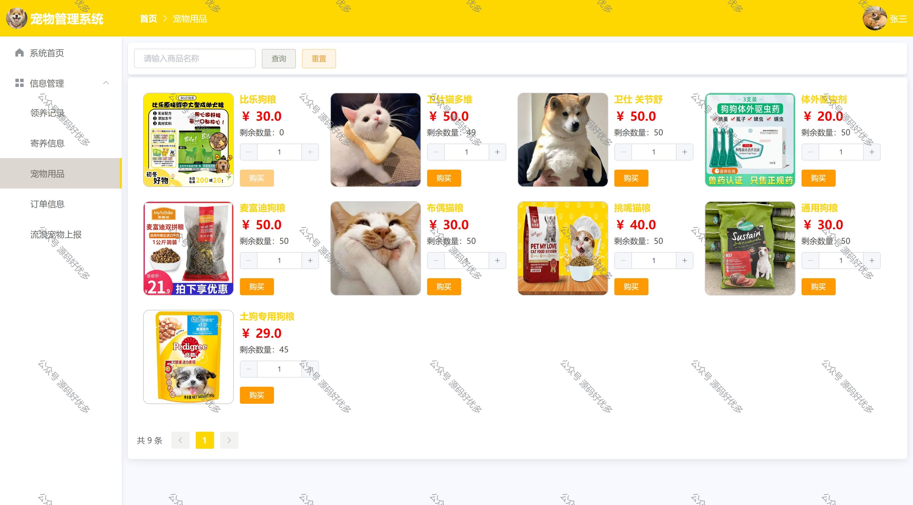
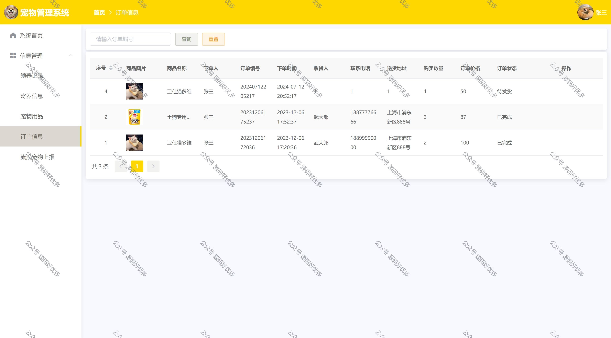
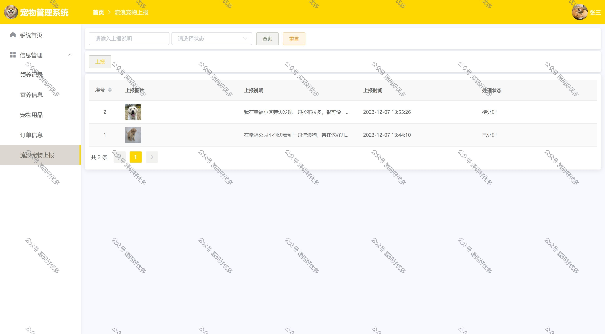
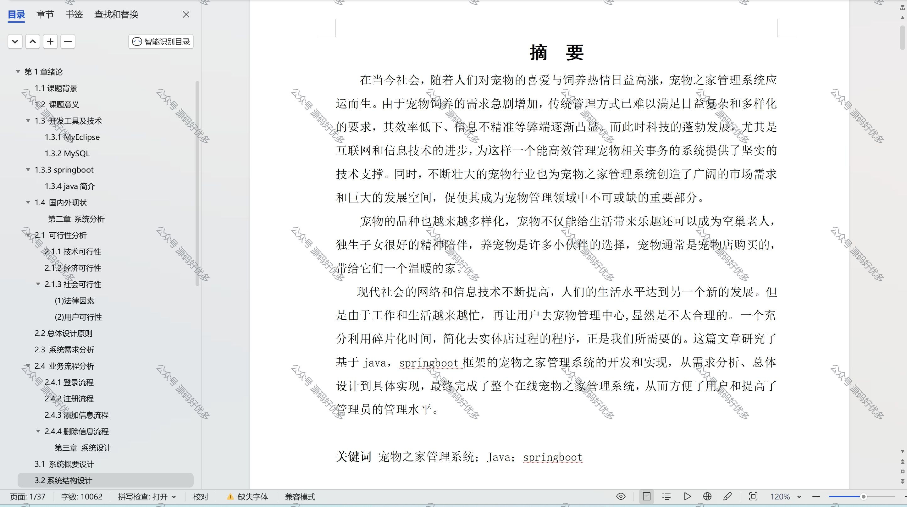

 
## 查看主页获取源码

> **作者介绍**： **✌**全网粉丝10W+本平台特邀作者、博客专家、CSDN新星计划导师、java领域优质创作者,博客之星、掘金/华为云/阿里云/InfoQ等平台优质作者、专注于项目实战 **✌**

  

### 一、作品包含

源码+数据库+设计文档万字+全套环境和工具资源+部署教程

### 二、项目技术

前端技术：Html、Css、Js、Vue

数据库：MySQL

后端技术：Java、Spring Boot、MyBatis

### 三、运行环境

开发工具：IDEA

数据库：MySQL8.0

数据库管理工具：Navicat10以上版本

环境配置软件： JDK1.8+Maven3.6.3

前端Nodejs：16

### 四、项目介绍
项目编号：springbootA047

网上宠物管理系统从本质上讲是一个电子商务模式综合而成的系统。实现了首页、个人中心、宠物分类管理、商品分类管理、宠物用品管理、宠物商店管理、宠物领养管理、用户管理、宠物寄存管理、用户领养管理、宠物挂失管理、论坛管理、管理员管理、系统管理、订单管理等基本功能

### 五、运行截图

